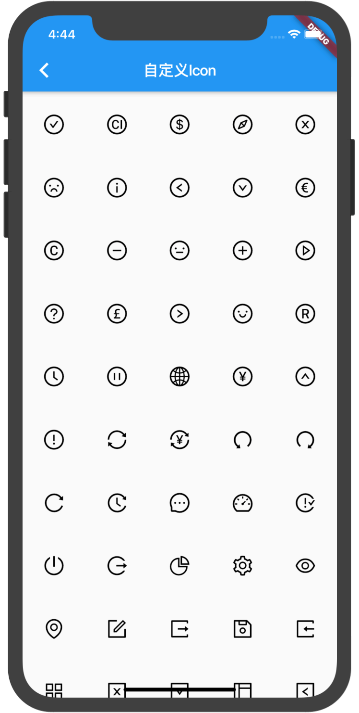
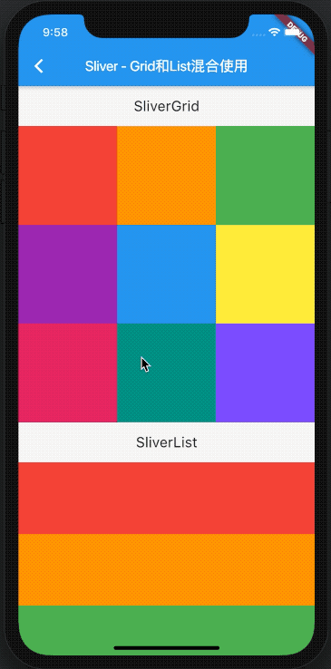
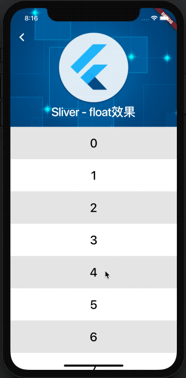
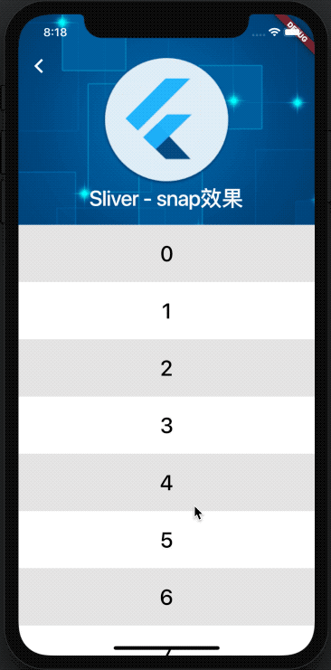
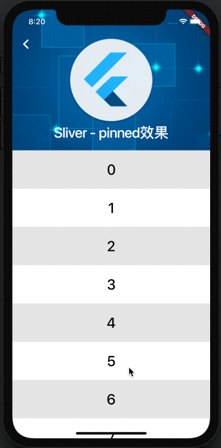
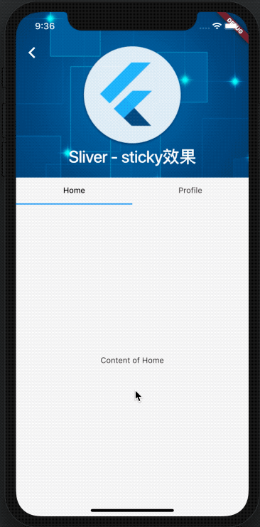

# flutter_training_demo

更新dart语法到最新版本2.17

现在各个模块的demo能够正常的运行，这里做一个笔记，与各位flutter爱好者共同学习

感谢原作者[SmallStoneSK](https://github.com/SmallStoneSK/flutter_training_app)：

原仓库地址：https://github.com/SmallStoneSK/flutter_training_app

## 预览

  
  
  
  
  
  
  
  
  
  
  
  
  
  
  
  
  
  

